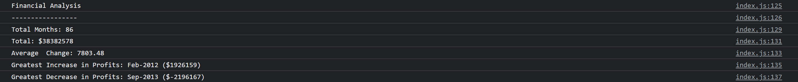

# Console Financial Analysis

## Description 

### User Story

```
AS A company correctly analysing my finances is important in evaluating my company's economic trends
I WANT a code that analyzes my company's financial records
SO THAT i can easily view and access data concerning our financial performance over a given period.
```

### Acceptance Criteria

```
* The JavaScript code must analyze the records given in a dataset.

* The JavaScript code must calculate the total number of months included in the dataset.

* The JavaScript code must calculate the net total amount of Profit/Losses over the entire period.

* The JavaScript code must calculate the average of the changes in Profit/Losses over the entire period.

* The code must also track the total changes in profits from month to month and before finding the average.

* The JavaScript code must calculate the greatest increase in profits (date and amount) over the entire period.

* The JavaScript code must calculate the greatest decrease in losses (date and amount) over the entire period.

```

## Table of Contents

* [Description](#description)
* [Usage](#usage)
* [Credits](#credits)
* [License](#license)

## Usage 

### Deployed Application

* The URL of the deployed application:
[https://thorbieey.github.io/Console-Finances-OT/](https://thorbieey.github.io/Console-Finances-OT/)

* The URL of the GitHub repository: 
[https://github.com/Thorbieey/Console-Finances-OT.git](https://github.com/Thorbieey/Console-Finances-OT.git))

#### Screenshot/Demo



## Credits

* [Format numbers using fixed-point notation](https://developer.mozilla.org/en-US/docs/Web/JavaScript/Reference/Global_Objects/Number/toFixed)
* [Meet array prototype: **push()**](https://developer.mozilla.org/en-US/docs/Web/JavaScript/Reference/Global_Objects/Array/push#:~:text=The%20push()%20method%20adds,new%20length%20of%20the%20array.)
* [Meet array prototype: **indexOf()**](https://developer.mozilla.org/en-US/docs/Web/JavaScript/Reference/Global_Objects/Array/indexOf)
* [Learn about selecting values in an array - part 1](https://developer.mozilla.org/en-US/docs/Web/JavaScript/Reference/Global_Objects/Math/max)
* [Learn about selecting values in an array - part 2](https://developer.mozilla.org/en-US/docs/Web/JavaScript/Reference/Global_Objects/Math/min)

## License

Licensed under the [MIT](https://choosealicense.com/licenses/mit/) license

